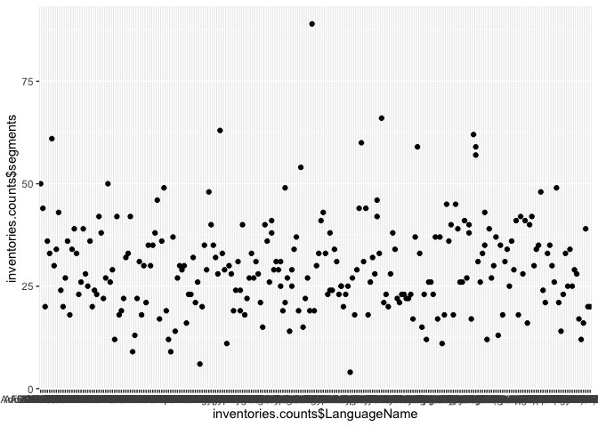
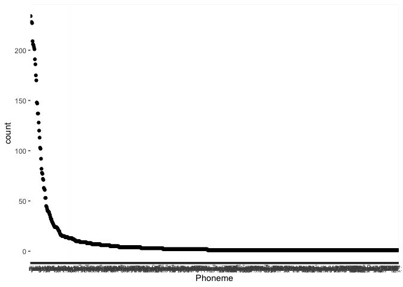
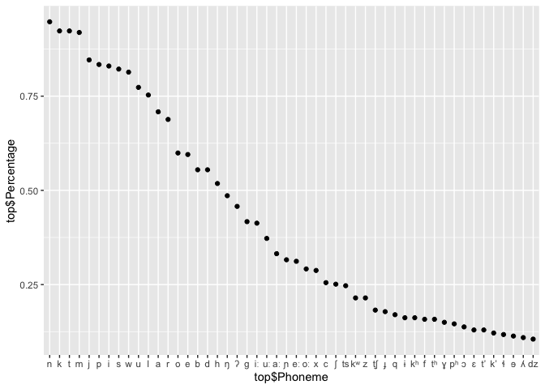
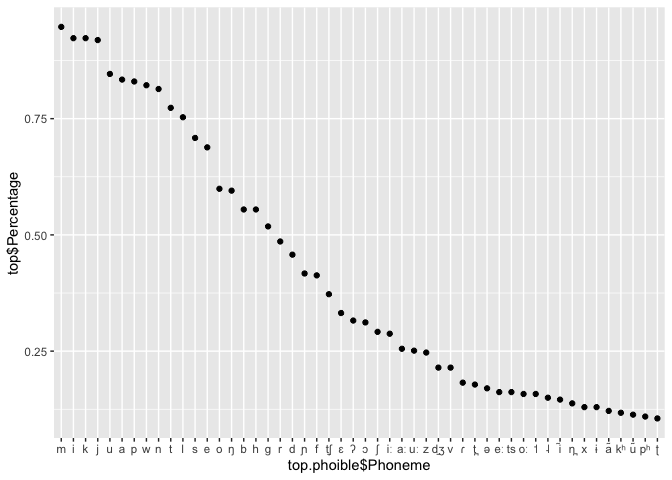
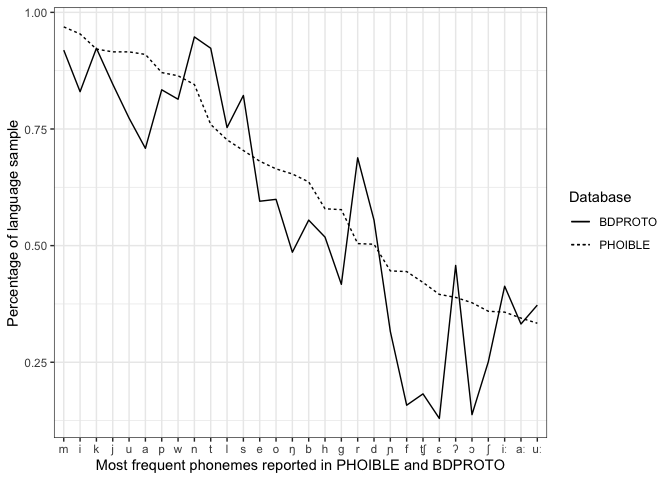

BDPROTO descriptive stats
================
Steven Moran

``` r
library(dplyr)
library(ggplot2)
library(knitr)
```

``` r
# Load BDPROTO data
load(file='../bdproto.Rdata')

# Take a look at the full data format
# glimpse(inventories)
```

``` r
# Display a subset
kable(inventories %>% select(BdprotoID, LanguageName, Glottocode, Phoneme, LanguageFamily, TimeDepthYBP) %>% arrange(BdprotoID)) %>% head()
```

    ## [1] " BdprotoID  LanguageName                   Glottocode   Phoneme   LanguageFamily                                      TimeDepthYBP"
    ## [2] "----------  -----------------------------  -----------  --------  -------------------------------------------------  -------------"
    ## [3] "         1  Proto-Berber                   berb1260     ɑ         Afro-Asiatic                                                7000"
    ## [4] "         1  Proto-Berber                   berb1260     i         Afro-Asiatic                                                7000"
    ## [5] "         1  Proto-Berber                   berb1260     u         Afro-Asiatic                                                7000"
    ## [6] "         1  Proto-Berber                   berb1260     ɑː        Afro-Asiatic                                                7000"

``` r
# How many total inventories are there (with duplicate languages)?
nrow(inventories %>% select(BdprotoID) %>% unique())
```

    ## [1] 257

``` r
# How many data points are there per data source?
sources <- inventories %>% select(BdprotoID, LanguageName, Source) %>% 
  group_by(BdprotoID, LanguageName, Source) %>% distinct()
table(sources$Source)
```

    ## 
    ##     ANE BDPROTO    HUJI      UZ 
    ##      21     101     120      15

``` r
# How many unique phonemes are there?
# TODO: some of these will have to be cleaned up, so the figure will be lower.
nrow(inventories %>% select(Phoneme) %>% group_by(Phoneme) %>% distinct())
```

    ## [1] 794

``` r
# How many language families are tagged?
nrow(inventories %>% select(LanguageFamily) %>% group_by(LanguageFamily) %>% distinct())
```

    ## [1] 124

``` r
# What are they?
# table(inventories %>% select(LanguageFamily) %>% group_by(LanguageFamily) %>% distinct())
```

``` r
# How many distinct vs duplicate data points are there?
temp <- inventories %>% select(BdprotoID, LanguageName, Glottocode, Duplicate) %>% unique() %>% arrange(LanguageName)
table(temp$Duplicate)
```

    ## 
    ## FALSE  TRUE 
    ##   178    79

``` r
# That is, there are 178 independent data points and 79 duplicated ones. Through manual inspection, we identified 3 sets of duplicates (9 data points), and the rest are doubles. This means: 70/2=25 + 3 + 178 == **206 unique language data points**.
```

``` r
# How many distinct Glottocodes are there? Some are NA (i.e. don't exist, e.g. Altaic) and others have not yet been identified.
bdproto.glottocodes <- inventories %>% select(Glottocode) %>% filter(!is.na(Glottocode)) %>% unique()
nrow(bdproto.glottocodes) # 187 without NAs or ""
```

    ## [1] 187

``` r
# How many Glottocodes are NA (i.e. we know there exists no Glottocode at the moment)?
# inventories %>% group_by(BdprotoID, Glottocode) %>% select(BdprotoID, Glottocode) %>% distinct() %>% filter(n()<1)
temp <- as.data.frame(inventories %>% select(BdprotoID, Glottocode) %>% distinct())
table(temp$Glottocode=="") # 22
```

    ## 
    ## FALSE  TRUE 
    ##   224    22

``` r
table(temp$Glottocode=="", exclude=F) # 11 NA
```

    ## 
    ## TRUE <NA> 
    ##   22   11

``` r
# TODO:
# library(testthat)
# expect_that() # 224 + 22 + 11 = 257
```

``` r
# Get the Glottolog family IDs -- this doesn't do much because language families don't have latitude, longitude, area, etc.
glottolog <- read.csv('glottolog_languoid.csv/languoid.csv', header=T, stringsAsFactors = F)
glottlog.families <- glottolog %>% select(family_id) %>% distinct()
```

``` r
# How many BDPROTO Glottocodes are in the Glottolog top-level language family trees?
table(bdproto.glottocodes$Glottocode %in% glottlog.families$family_id)
```

    ## 
    ## FALSE  TRUE 
    ##   131    56

``` r
# Which ones?
kable(bdproto.glottocodes[which(bdproto.glottocodes$Glottocode %in% glottlog.families$family_id), ])
```

| Glottocode |
|:-----------|
| afro1255   |
| araw1281   |
| aust1307   |
| chib1249   |
| chim1311   |
| chuk1271   |
| drav1251   |
| eski1264   |
| guah1252   |
| ijoi1239   |
| indo1319   |
| kart1248   |
| kere1287   |
| lake1255   |
| lowe1437   |
| maid1262   |
| mand1469   |
| maya1287   |
| otom1299   |
| basq1248   |
| maba1274   |
| nubi1251   |
| pomo1273   |
| sali1255   |
| taik1256   |
| toto1251   |
| tuca1253   |
| tupi1275   |
| ural1272   |
| utoa1244   |
| yoku1255   |
| mixe1284   |
| turk1311   |
| mong1329   |
| aust1305   |
| iroq1247   |
| timo1261   |
| nort2923   |
| nucl1709   |
| cadd1255   |
| quec1387   |
| ayma1253   |
| barb1265   |
|            |
| nilo1247   |
| nucl1710   |
| jica1245   |
| tsim1258   |
| gunw1250   |
| siou1252   |
| pama1250   |
| guai1249   |
| miwo1274   |
| musk1252   |
| huav1256   |
| koma1264   |

``` r
# How many segments do the proto-languages have? (Note some inventories only have consonant or vowel inventories specified, so we filter by the `InventoryType` field.)
inventories.counts <- inventories %>% select(BdprotoID, LanguageName, InventoryType) %>% group_by(BdprotoID, LanguageName, InventoryType) %>% summarize(segments=n()) %>% arrange(segments)
dim(inventories.counts)
```

    ## [1] 257   4

``` r
# Drop consonant and vowel only inventories (currently 10 data points)
inventories.counts.cs.vs <- inventories.counts %>% filter(is.na(InventoryType))
dim(inventories.counts.cs.vs)
```

    ## [1] 247   4

``` r
# What is the median and mean number of segments in the sample (for full consonant and vowel inventories)?
summary(inventories.counts.cs.vs$segments)
```

    ##    Min. 1st Qu.  Median    Mean 3rd Qu.    Max. 
    ##   11.00   23.00   29.00   30.35   36.00   89.00

``` r
# All segment types
# TODO: fix the NAs in the input data
table(inventories$type, exclude=F)
```

    ## 
    ##    C    V <NA> 
    ## 5495 2125   22

``` r
# Get consonant counts and stats of ALL inventories
inventories.consonants <- inventories %>% filter(is.na(InventoryType) | InventoryType=="consonants") %>% filter(Source!="ANE") 
table(inventories.consonants$InventoryType, exclude=F)
```

    ## 
    ## consonants       <NA> 
    ##        103       6831

``` r
# Get the consonant counts per inventory (252 data points)
c.counts <- inventories.consonants %>% select(BdprotoID, Phoneme, type) %>% filter(type=="C") %>%  group_by(BdprotoID) %>% summarize(consonants = n())
summary(c.counts$consonants)
```

    ##    Min. 1st Qu.  Median    Mean 3rd Qu.    Max. 
    ##    5.00   15.00   19.00   21.48   26.00   69.00

``` r
# Get consonant counts and stats of original BDPROTO (one data point per genealogical unit)
og.bdproto.cs <- inventories %>% filter(is.na(InventoryType) | InventoryType=="consonants") %>% filter(Source=="BDPROTO")

# Get the consonant counts per inventory (252 data points)
og.c.counts <- og.bdproto.cs %>% select(BdprotoID, Phoneme, type) %>% filter(type=="C") %>% group_by(BdprotoID) %>% summarize(consonants = n())
summary(og.c.counts$consonants)
```

    ##    Min. 1st Qu.  Median    Mean 3rd Qu.    Max. 
    ##    5.00   15.75   19.00   21.00   26.25   42.00

``` r
# Get vowel counts and stats of ALL inventories
inventories.vowels <- inventories %>% filter(is.na(InventoryType) | InventoryType=="vowels") %>% filter(Source!="ANE")
table(inventories.vowels$InventoryType, exclude=F)
```

    ## 
    ## vowels   <NA> 
    ##     42   6831

``` r
# Get the vowel counts per inventory (should be 252 data points)
v.counts <- inventories.vowels %>% select(BdprotoID, Phoneme, type) %>% filter(type=="V") %>% group_by(BdprotoID) %>% summarize(vowels = n())
summary(v.counts$vowels)
```

    ##    Min. 1st Qu.  Median    Mean 3rd Qu.    Max. 
    ##   2.000   6.000  10.000   9.905  13.000  29.000

``` r
# Get vowel counts and stats of original BDPROTO  (one data point per genealogical unit)
og.bdproto.vs <- inventories %>% filter(is.na(InventoryType) | InventoryType=="vowels") %>% filter(Source=="BDPROTO")

# Get the consonant counts per inventory (252 data points)
og.v.counts <- og.bdproto.vs %>% select(BdprotoID, Phoneme, type) %>% filter(type=="V") %>% group_by(BdprotoID) %>% summarize(vowels = n())
summary(og.v.counts$vowels)
```

    ##    Min. 1st Qu.  Median    Mean 3rd Qu.    Max. 
    ##   3.000   6.000   8.000   9.097  12.000  29.000

``` r
# Plot segment counts (all inventories)
inventories.counts$BdprotoID <- factor(inventories.counts$BdprotoID, levels=inventories.counts$BdprotoID[order(-inventories.counts$segments)])
qplot(inventories.counts$LanguageName, inventories.counts$segments)
```



``` r
# What is the frequency of segments across the proto-languages? Use only inventories that have both consonant and vowel descriptions.
inventories.cs.vs <- inventories %>% filter(is.na(InventoryType))
segment.counts <- inventories.cs.vs %>% select(Phoneme) %>% group_by(Phoneme) %>% summarize(count=n()) %>% arrange(desc(count)) %>% filter(!is.na(Phoneme))
dim(segment.counts)
```

    ## [1] 784   2

``` r
head(segment.counts)
```

    ## # A tibble: 6 x 2
    ##   Phoneme count
    ##   <chr>   <int>
    ## 1 n         234
    ## 2 k         228
    ## 3 t         228
    ## 4 m         227
    ## 5 j         209
    ## 6 p         206

``` r
# Get percentages
total.inventories <- nrow(inventories.cs.vs %>% select(BdprotoID) %>% distinct())
segment.counts$Percentage <- segment.counts$count/total.inventories

# Plot it
segment.counts$Phoneme <- factor(segment.counts$Phoneme, levels=segment.counts$Phoneme[order(-segment.counts$count)])
ggplot(segment.counts, aes(x=Phoneme, y=count))+
geom_point() + 
ylab('count') +
xlab('Phoneme')
```



``` r
# Plot just the top 50 most frequent segments
top <- head(segment.counts, n=50)
# qplot(top$Phoneme, top$count)
qplot(top$Phoneme, top$Percentage)
```



``` r
# Get phoible phonemes for comparison
load(url('https://github.com/phoible/dev/blob/master/data/phoible.RData?raw=true'))

# PHOIBLE inventories are not unique (3020)
num.phoible.inventories <- nrow(phoible %>% select(InventoryID) %>% distinct())

# Get number of unique inventories by Glottocode (2185)
num.phoible.inventories <- nrow(phoible %>% select(Glottocode) %>% distinct())

# Get phoneme counts and percentages
phoible.phonemes <- phoible %>% select(Glottocode, Phoneme) %>% group_by(Glottocode) %>% distinct() %>% group_by(Phoneme) %>% summarize(count=n()) %>% arrange(desc(count))

phoible.phonemes$Percentage <- phoible.phonemes$count/num.phoible.inventories
head(phoible.phonemes)
```

    ## # A tibble: 6 x 3
    ##   Phoneme count Percentage
    ##   <chr>   <int>      <dbl>
    ## 1 m        2117      0.969
    ## 2 i        2084      0.954
    ## 3 k        2013      0.921
    ## 4 j        2000      0.915
    ## 5 u        2000      0.915
    ## 6 a        1988      0.910

``` r
phoible.phonemes$Phoneme <- factor(phoible.phonemes$Phoneme, levels=phoible.phonemes$Phoneme[order(-phoible.phonemes$count)])
```

``` r
# Frequency distribution of phonemes in phoible
qplot(phoible.phonemes$Phoneme, phoible.phonemes$Percentage)
```


``` r
# Frequency distribution of 50 most frequent phonemes in phoible
top.phoible <- head(phoible.phonemes, n=50)
qplot(top.phoible$Phoneme, top$Percentage)
```



``` r
# Combine the phoneme counts to plot them together in one graph
x <- phoible.phonemes
colnames(x) <- c("Phoneme", "Phoible.count", "Phoible.percentage")
y <- segment.counts
colnames(y) <- c("Phoneme", "Bdproto.count", "Bdproto.percentage")
z <- left_join(x,y)
```

    ## Joining, by = "Phoneme"

    ## Warning: Column `Phoneme` joining factors with different levels, coercing
    ## to character vector

``` r
rm(x,y)

# Reorder phonemes as factor
z$Phoneme <- factor(z$Phoneme, levels=z$Phoneme[order(-z$Phoible.count)])
```

``` r
# Try top 30 phonemes
top.z <- head(z, n=30)

ggplot(data = top.z, aes(x = Phoneme, group=1)) +
  geom_line(aes(y = Phoible.percentage, color = "PHOIBLE")) + 
  geom_line(aes(y = Bdproto.percentage, color = "BDPROTO")) +
  ylab("Percentage of language sample") +
  xlab("Most frequent phonemes reported in PHOIBLE") +
  labs(color="Database") +
  theme_bw()
```


``` r
# Try top 50 phonemes
top.z <- head(z, n=50)

# Some phonemes occur very rarely in BDPROTO (or not at all) compared to PHOIBLE, e.g. /ts/ occurs at 2.5%. High tone not at all.
top.z %>% filter(Phoneme=="ts")
```

    ## # A tibble: 1 x 5
    ##   Phoneme Phoible.count Phoible.percentage Bdproto.count Bdproto.percentage
    ##   <fct>           <int>              <dbl>         <int>              <dbl>
    ## 1 ts                523              0.239            61              0.247

``` r
top.z %>% filter(Phoneme=="˦")
```

    ## # A tibble: 1 x 5
    ##   Phoneme Phoible.count Phoible.percentage Bdproto.count Bdproto.percentage
    ##   <fct>           <int>              <dbl>         <int>              <dbl>
    ## 1 ˦                 495              0.227            NA                 NA

``` r
ggplot(data = top.z, aes(x = Phoneme, group=1)) +
  geom_line(aes(y = Phoible.percentage, color = "PHOIBLE")) + 
  geom_line(aes(y = Bdproto.percentage, color = "BDPROTO")) +
  ylab("Percentage of language sample") +
  xlab("Most frequent phonemes reported in PHOIBLE") +
  labs(color="Database") +
  theme_bw()
```



``` r
# Get dates
inventories.dates <- inventories.cs.vs %>% select(BdprotoID, LanguageName, LanguageFamily, TimeDepthYBP) %>% group_by(BdprotoID, LanguageName, LanguageFamily, TimeDepthYBP) %>% distinct() %>% arrange(desc(TimeDepthYBP)) %>% filter(TimeDepthYBP < 10001)
head(inventories.dates)
```

    ## # A tibble: 6 x 4
    ## # Groups:   BdprotoID, LanguageName, LanguageFamily, TimeDepthYBP [6]
    ##   BdprotoID LanguageName   LanguageFamily                     TimeDepthYBP
    ##       <int> <chr>          <chr>                                     <int>
    ## 1      1061 AFRO-ASIATIC   Afro-Asiatic                              10000
    ## 2      1114 URALO-SIBERIAN Macro-Macro-Family, Uralo-Siberian        10000
    ## 3      1062 CUSHITIC       Afro-Asiatic, Cushitic                     8500
    ## 4      1084 URALIC         Ural-Altaic, Uralic                        8000
    ## 5      1053 ALTAIC         Ural-Altaic, Altaic                        7000
    ## 6      1083 CHADIC         Afro-Asiatic, Chadic                       7000

``` r
# Get coverage by Glottolog macroarea

# Get the geo/genealogical data from Glottolog
geo <- read.csv(url("https://cdstar.shh.mpg.de/bitstreams/EAEA0-E7DE-FA06-8817-0/languages_and_dialects_geo.csv"), stringsAsFactors = FALSE)

# Merge with the BDPROTO data points
temp <- left_join(bdproto.glottocodes, geo, by=c("Glottocode"="glottocode"))
head(temp)
```

    ## # A tibble: 6 x 7
    ##   Glottocode name  isocodes level macroarea latitude longitude
    ##   <chr>      <chr> <chr>    <chr> <chr>        <dbl>     <dbl>
    ## 1 afro1255   <NA>  <NA>     <NA>  <NA>            NA        NA
    ## 2 algo1256   <NA>  <NA>     <NA>  <NA>            NA        NA
    ## 3 anat1257   <NA>  <NA>     <NA>  <NA>            NA        NA
    ## 4 araw1281   <NA>  <NA>     <NA>  <NA>            NA        NA
    ## 5 atha1247   <NA>  <NA>     <NA>  <NA>            NA        NA
    ## 6 atti1238   <NA>  <NA>     <NA>  <NA>            NA        NA

``` r
# Problem here is that language family level codes, e.g. grea1284 (Greater Central Philippine), are not associated with macroarea, lat, long, etc.

# So this number is completely off and represent essentially language isolates (which are their own family)
table(temp$macroarea, exclude=FALSE)
```

    ## 
    ##                      Africa       Eurasia North America     Papunesia 
    ##             1             4            25             7             2 
    ## South America          <NA> 
    ##             1           147

``` r
# TODO: infer the macroarea of a language family in Glottolog by it's daughter language(s)
```

``` r
# Be kind and clean up the workspace
rm(list = ls())
```

<!-- 
########################################################
# Merge results in segments with NA for feature values #
########################################################
inventories %>% dplyr::filter(is.na(consonantal)) %>% select(ID, Name, Glottocode) %>% unique()
missing.segments <- inventories %>% filter(is.na(consonantal)) %>% select(Phoneme) %>% unique()
write.table(missing.segments, "missing-segments.csv", sep="\t", quote = F, row.names = F)

# There are 36 languages that have one or more missing feature vectors.
dim(inventories %>% filter(is.na(consonantal)) %>% select(ID, Name) %>% unique())
no.feature.vectors <- anti_join(inventories, features)
no.feature.vectors <- no.feature.vectors %>% select(ID, Name, Phoneme, Source) %>% arrange(Name) %>% arrange(ID)
nrow(no.feature.vectors) # 91 feature vectors missing (with duplicates)
dim(no.feature.vectors %>% distinct(LanguageName)) # 36 distinct segments
head(no.feature.vectors)
-->
